<!-- #region ⁡⁢⁣⁣Botón de navegación al indice⁡ -->

<a href="#0">
<button style="
width:40px; 
height:40px; 
border-radius:50%;
background-color:#ffffff80;
position:fixed;
bottom:5px;
right:5px;
">
👆
</button>
</a>

<!-- #endregion -->

<!-- #region ⁡⁢⁣⁣Indice⁡ -->
<details style="background-color:#ffffff10; padding:10px;">
<summary><span style="font-size:2.5rem;" id="0">Indice</span></summary>
<div>
<ol>
<li>Instalación</li>
<li>Creación de un proyecto base</li>
<li><a href="#3">Estructura básica de un proyecto</a></li>
<li><a href="#4">Ejecución del programa</a></li>
<li><a href="#5">Ejecutar extensión sin comandos</a></li>
<li><a href="#6">Operaciones de archivos</a>
  <ol style="margin:0; padding:0;">
    <li style="list-style: none; transform: translateX(1rem);"><span>6a.</span> <a href="#6a">Lectura de archivos</a></li>
    <li style="list-style: none; transform: translateX(1rem);"><span>6b.</span> <a href="#6b">Edición de archivos</a></li>
    <li style="list-style: none; transform: translateX(1rem);"><span>6c.</span> <a href="#6c">Decoradores</a></li>
  </ol>
</li>
<li><a href="#7">Actualización en tiempo real</a></li>
<li><a href="#8">Botones en el panel de titulo/editor</a></li>
<li><a href="#9">Codicon - íconos para extensiones en vsc</a></li>
<li><a href="#10">Métodos de almacenamiento de información</a>
  <ol style="margin:0; padding:0;">
    <li style="list-style: none; transform: translateX(1rem);"><span>10a.</span> <a href="#10a">Almacenamiento global</a></li>
  </ol>
</li>
<li><a href="#11">Menú desplegable en el editor titulo/editor</a>
  <ol style="margin:0; padding:0;">
    <li style="list-style: none; transform: translateX(1rem);"><span>11a.</span> <a href="#10a">Despliegue desde el botón</a></li>
  </ol>
</li>
<li><a href="#12">Segmentos colapsables</a>
</ol>
</div>
</details>

---
<!-- #endregion -->

<!-- #region ⁡⁢⁣⁣3. Estructura básica de un proyecto⁡ -->
<details style="background-color:#ffffff10; padding:10px;">
<summary><span style="font-size:2.5rem;" id="3">3. Estructura básica de un proyecto</span></summary>
<div>

1. En el package.json debemos buscar la siguiente sección:
    ```json
    "contributes": {
      "commands": [
        {
          "command": "color-suit-comments.helloWorld",
          "title": "Hello World"
        }
      ]
    },
    ```
    Notar que en el arreglo 'commands' podemos crear una lista de comandos, en este caso se ha creado por defecto un comando llamado `color-suit-comments.helloWorld` y se le pone un título `Hello World`, el cual será el texto que aparecerá en la paleta de comando del vsc.

2. El archivo de entrada por defecto es `src/extension.ts`

3. El archivo tiene la siguiente estructura básica: 
    ```ts 
    // Importación de la API de vscode
    import * as vscode from 'vscode';

    // El método 'activate' se ejecuta al iniciar la extensión
    export function activate(context: vscode.ExtensionContext) {
      // Se debe definir un comando en el package.json
      // Luego, se provee la implementación del comando creado con el método 'registerCommand'
      // En este caso, el comando creado se llama 'color-suit-comments.helloWorld'
      const disposable = vscode.commands.registerCommand('color-suit-comments.helloWorld', () => {
        // Código a ejecutar cuando se ejecuta el comando creado
        // El método 'showInformationMessage' muestra un mensaje en un tooltip
        vscode.window.showInformationMessage('Hello World from Color Suit Comments!');
      });

      // El comando creado quedará disponible en el buscador de compandos al presionar ctrl+shift+p
      context.subscriptions.push(disposable);
    }

    // El método 'deactivate' se ejecuta al desactivar la extensión.
    export function deactivate() {}
    ```

</div>
</details>

---
<!-- #endregion -->

<!-- #region ⁡⁢⁣⁣4. Ejecución del programa⁡ -->
<details style="background-color:#ffffff10; padding:10px;">
<summary><span style="font-size:2.5rem;" id="4">4. Ejecución del programa</span></summary>
<div>

1. Presionar **F5**, esto abrirá una nueva ventana de VSC donde se emulará la extensión que se esta desarrollando, permitiendo la interacción con dicha extensión. 
    <div style="background-color:#e0e04030; padding: 5px"><b>⚠ IMPORTANTE</b>: Evitar abrir en la nueva ventana de <b>vsc</b> el mismo proyecto de la extensión, esto podria genenar problemas a la hora de detectar los comandos. Deberia funcionar con normalidad en cualquier otro proyecto.</div>

2. En la nueva ventana abierta ejecutar la combinación **ctrl+shift+p** para abrir la ventana de comandos en la sección superior de vsc.

3. Ejecutar el comando creacdo mediante el alias que se le ha creado **"Hello World"**. Deberia verse algo parecido a esto:

    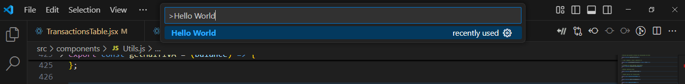

4. Al ejecutar el comando, aparecera un popup mostrando el mensaje que aparecia en el código escrito en el archivo `src/extension.ts`.

    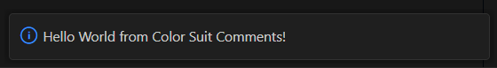
</div>
</details>

---
<!-- #endregion -->

<!-- #region ⁡⁢⁣⁣5. Ejecutar extensión sin comandos⁡ -->
<details style="background-color:#ffffff10; padding:10px;">
<summary><span style="font-size:2.5rem;" id="5">5. Ejecutar extensión sin comandos</span></summary>
<div>

  1. Editar el `package.json` modificando el campo `activationEvents`, aquí estarán disponibles las diferentes formas que se ofrecen para ejecutar los scrpts de la extensión. La siguiente opción ejecuta la lógica de nuestra extensión luego de que vsc haya ejecutado las demás extensiones:

      ``` json
        "activationEvents": [
          "onStartupFinished"
        ],
      ```

  2. En el siguiente ejemplo, se modifica `extension.ts` para mostrar una ventana de información al abrir una ventana de vsc con nuestro ejemplo:

      ``` ts
      import * as vscode from 'vscode';
      export function activate(context: vscode.ExtensionContext) {
        vscode.window.showInformationMessage('La extensión se activó automáticamente 🚀');
      }
      export function deactivate() {}
      ```

  3. Para verificar que funciona, despues de guardar los cambios se presiona F5 y al abrir la nueva ventana de vsc se deberia ver el siguiente mensaje en la sección inferior derecha de la pantalla:

      

</div>
</details>

---
<!-- #endregion -->

<!-- #region ⁡⁢⁣⁣6. Operaciones de archivos⁡ -->
<div style="background-color:#ffffff10; padding:10px;">
<span style="font-size:2.5rem;" id="6">6. Operaciones de archivos</span>
<div>

<!-- #region ⁡⁢⁣⁣6a. Lectura de archivos⁡ -->

<details style="background-color:#ffffff10; padding:10px; margin:5px 0">
<summary><span style="font-size:1.5rem;" id="6a">6a. Lectura de archivos</span></summary>
<div>

El siguiente ejemplo muestra como capturar el contenido de un archivo:

``` ts
const editor = vscode.window.activeTextEditor;

if (editor) {
  const document = editor.document;
  const content = document.getText();
}
```

* La variable `editor` brinda acceso al editor activo (el archivo actualmente abierto en primer plano). 
* La variable `document` representa el documento con todas sus características.
* La variable `content` contiene todo el contenido del documento como un string.

<div style="background-color:#e0e04030; padding: 5px"><b>⚠ IMPORTANTE</b>: El contenido retornado por <b>document.getText()</b> es un string inmutable, si se desea editar el contenido debe crearse un nuevo string a partir de esta variable.</div>

</div>
</details>

<!-- #endregion -->

<!-- #region ⁡⁢⁣⁣6b. Edición de archivos⁡ -->

<details style="background-color:#ffffff10; padding:10px; margin:5px 0">
<summary><span style="font-size:1.5rem;" id="6b">6b. Edición de archivos</span></summary>
<div>
En esta sección se abordará el como se puede editar el contenido de un archivo. Los pasos a seguir son los siguientes:

1. Obtener el contenido del documento (suele ser inmutable).
2. Crear una copia y editarla bajo algún criterio.
3. Definir la posición inicial y final de los punteros que marcarán la zona del documento a reemplazar.
4. Reemplazar el contenido del documento con el método `replace` del editor.

El siguiente ejemplo busca y elimina todos los comentarios con el formato `/** comentario */`.

``` ts
import * as vscode from 'vscode';

export function activate(context: vscode.ExtensionContext) {

const editor = vscode.window.activeTextEditor;

if (editor) {
  const document = editor.document;
  const fullText = document.getText();

  // Acá modificás el texto como quieras
  const newText = fullText.replace(/(\/\*\*).*(\*\/)/gm, '');

  // Ahora reemplazamos todo el contenido
  const fullRange = new vscode.Range(
    document.positionAt(0),
    document.positionAt(fullText.length)
  );

  // Se edita el documento
  editor.edit(editBuilder => {
    editBuilder.replace(fullRange, newText);
  });
  }
}

export function deactivate() {}
```

Finalmente, a continuación se presenta el documento antes y después de aplicar el efecto de la extensión.

Antes:
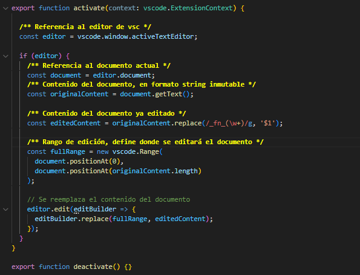

Despues:
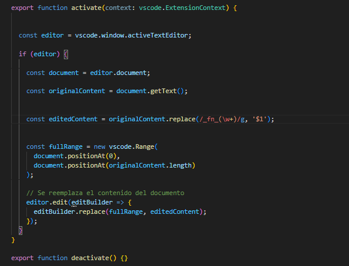

</div>
</details>

<!-- #endregion -->

<!-- #region ⁡⁢⁣⁣6c. Decoradores⁡ -->

<details style="background-color:#ffffff10; padding:10px; margin:5px 0">
<summary><span style="font-size:1.5rem;" id="6c">6c. Decoradores</span></summary>
<div>
Los decoradores son una forma de aplicar estilos visuales a fragmentos de texto en un archivo, sin modificar el contenido real del archivo.
Los decoradores permiten:

* Agregar color a palabras o líneas.
* Resaltar o subrayar fragmentos de texto.
* Agregar fondos, bordes, margenes, etc.
* Mostrar un tooltip al hacer hover sobre un fragmento de texto.

<div style="background-color:#e0e04030; padding: 5px"><b>⚠ IMPORTANTE</b>: Los decoradores no alteran el texto del archivo, solamente lo decora de forma visual.</div>

Para usar decoradores en un segmento especifico del archivo se deben seguir estos pasos:

1. Obtener el contenido del documento
2. Obtener las posiciones inicial y final de los segmentos del documento que se desea estilizar, se recomienda usar expresiones regulares para esto.
3. Usar un arreglo de tipo `vscode.DecorationOptions` para indicar los segmentos del documento que se van a editar, también se puede agregar un mensaje de hover para los segmentos marcados.
4. Crear una variable con `vscode.window.createTextEditorDecorationType` para definir que decoraciones se quieren aplicar a los segmentos indicados.
5. Aplicar las decoraciones con el método `setDecorations`

Todos los pasos anteriores se ven reflejados en el siguiente ejemplo, el cual busca comentarios con el formato `/** comentario... */`, le agrega un mensaje de hover y lo pinta de amarillo en su totalidad.

``` ts
import * as vscode from 'vscode';

export function activate(context: vscode.ExtensionContext) {

  /** Referencia al editor de vsc */
  const editor = vscode.window.activeTextEditor;

  if (editor) {
    /** Referencia al documento actual */
    const document = editor.document;
    /** Contenido del documento, en formato string inmutable */
    const originalContent = document.getText();

    /** Expresiòn regular para detectar comentarios */
    const regex = /(\/\*\*).*(\*\/)/gm;

    /** Arreglo que va a almacenar los matches de la expresiòn regular con el contenido del documento */
    const matches: vscode.DecorationOptions[] = [];

    /** Variable a la cual se le va a asignar el match actual con la expresión regular */
    let match;

    // Se itera para cada coincidencia entre la expresión regular y el contenido del documento
    while ((match = regex.exec(originalContent)) !== null) { 
      const startPos = document.positionAt(match.index); // Inicio de la coincidencia
      const endPos = document.positionAt(match.index + match[0].length); // Final de la coincidencia

      // Se guarda la coincidencia actual y se asigna un mensaje de hover
      matches.push({
        range: new vscode.Range(startPos, endPos),
        hoverMessage: 'Esta es una función especial',
      });
    }

    /** Contiene los decoradores que se desean agregar al documento */
    const yellowTextDecoration = vscode.window.createTextEditorDecorationType({
      color: 'yellow',
      fontWeight: 'bold',
    });

    // Se aplican los decoradores en las secciones definidas en matches
    editor.setDecorations(yellowTextDecoration, matches);
  }
}

export function deactivate() {}
```

Se configura el package.json para que la extensión se ejecute al abrir un documento .ts o .js, luego, al abrir un documento con estos formatos, el resultado es el siguiente:

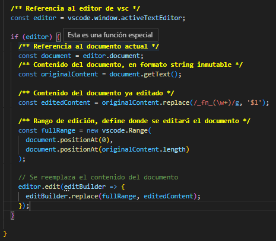

En la imagen se puede apreciar el efecto de los decoradores en los comentarios (ahora son amarillos) y el mensaje `Esta es una función especial` que aparece al hacer hover sobre los comentarios.


</div>
</details>

<!-- #endregion -->

</div>
</div>

---
<!-- #endregion -->

<!-- #region ⁡⁢⁣⁣7. Actualización en tiempo real⁡ -->
<details style="background-color:#ffffff10; padding:10px;">
<summary><span style="font-size:2.5rem;" id="7">7. Actualización en tiempo real</span></summary>
<div>
En esta sección se muestra un ejemplo funcional que permite agregar decoradores en tiempo real dentro de un archivo a medida que es modificado. Para lograr esto se debe:

1. Obtener el contexto de la extensión de vsc que se esta creando.
2. Crear la decoración que se le va a aplicar al documento.
3. Crear un listener que se ejecute cada vez que el documento dentro del contexto de nuestra extensión es editado y suscribirlo a la lista de eventos que va a manejar el workspace (la ventana activa de vsc).

El siguiente código implementa una extensión que añade decoradores a los comentarios con el formato `/** comentario */`.

``` ts
import * as vscode from 'vscode';

export function activate(context: vscode.ExtensionContext) {

  // Creamos el tipo de decoración una sola vez
  const decorationForComments = getDecorationForComments();

  // Evento que se ejecuta cada vez que el usuario cambia el texto
  context.subscriptions.push(
    vscode.workspace.onDidChangeTextDocument(event => handleDocumentTextHasChanged(event, decorationForComments))
  );

  // También aplicamos decoraciones al abrir la extensión
  if (vscode.window.activeTextEditor) {
    applyDecorations(vscode.window.activeTextEditor, decorationForComments);
  }
}

export function deactivate() {}


/** Retorna una decoración personalizada para los comentarios */
const getDecorationForComments = (): vscode.TextEditorDecorationType => {
  return vscode.window.createTextEditorDecorationType({
    backgroundColor: '#f0f06010',
    color: '#f0f060',
  });
};

/** Función que analiza el contenido del editor y aplica decoraciones */
const applyDecorations = (editor: vscode.TextEditor | undefined, decorator: vscode.TextEditorDecorationType) => {
  if (!editor || !decorator) {
    return;
  }

  const document = editor.document;
  const content = document.getText();
  const regex = /(\/\*\*).*(\*\/)/gm;
  const matches: vscode.DecorationOptions[] = [];

  let match;
  while ((match = regex.exec(content)) !== null) {
    const startPos = document.positionAt(match.index);
    const endPos = document.positionAt(match.index + match[0].length);

    matches.push({
      range: new vscode.Range(startPos, endPos),
      hoverMessage: 'Esta es una función especial',
    });
  }

  editor.setDecorations(decorator, matches);
};

/** Función que se ejecuta por medio del evento al editar un documento. */
const handleDocumentTextHasChanged = (event:vscode.TextDocumentChangeEvent, decorator: vscode.TextEditorDecorationType) => {
  const activeEditor = vscode.window.activeTextEditor;
  if (activeEditor && event.document === activeEditor.document) {
    applyDecorations(activeEditor, decorator);
  }
};
```


</div>
</details>

---
<!-- #endregion -->

<!-- #region ⁡⁢⁣⁣8. Botones en el panel de titulo/editor⁡ -->
<details style="background-color:#ffffff10; padding:10px;">
<summary><span style="font-size:2.5rem;" id="8">8. Botones en el panel de titulo/editor</span></summary>
<div>

El panel title/editor es el panel en el cual se muestran las pestañas de los documentos en VSC.
Para crear botones en dicha sección solamente hay que editar el `package.json`. Posteriormente, para agregar funcionalidad a dichos botones debemos editar el `extension.ts`.

A continuación se muestra la configuración de campo `contributes` en el `package.json` para crear dos botones:

``` JSON
  "contributes": {
    "commands": [
      {
        "command": "colorSuitComments.btn1",
        "title": "btn1",
        "icon": "$(check)"
      },
      {
        "command": "colorSuitComments.btn2",
        "title": "btn2",
        "icon": "icon.png"
      }
    ],
    "menus":{
      "editor/title": [
        {
          "command": "colorSuitComments.btn1",
          "group": "navigation@1"
        },
        {
          "command": "colorSuitComments.btn2",
          "group": "navigation@2"
        }
      ]
    }
  },
```
Analizando ese segmento de `package.json` se puede destacar lo siguiente:
1. El campo `contributes` tiene internamente dos campos, el primero es `commands` en el cual se definen los comandos (o ordenes) a ejecutar.
2. Cada comando definido dentro de `commands` debe tener el campo `command` el cual define la manera en la cual se va a referenciar a dicho comando dentro de `extension.ts` para agregarle lógica y también debe tener el campo `title` lo cual define el nombre del comando si se lo busca en la ventana de comandos (ctrl+shift+p) o será directamente el nombre asignado al botón en este caso.
3. Opcionalmente se le puede agregar un ícono al botón, ya sea referenciando un archivo dentro del proyecto (como en btn1) o usando uno de los íconos disponibles en el siguiente enlace https://microsoft.github.io/vscode-codicons/dist/codicon.html (como en btn2).
4. El campo `menus` permite definir formas de interactuar con los comandos, agregando botones en este caso.
5. Al usar internamente `editor/title` estamos creando botones en le panel title/editor (donde se muestran las pestañas), luego con el campo `command` estamos definiendo que comando se va a ejecutar al interactuar con el botón y finalmente con `group` podemos desplegar los botones en diferentes grupos (a veces con una linea separadora), además, con el valor agregado despues del arroba se puede establecer el orden de aparición de los botones dentro de un grupo. En este caso `btn1 >> navigation@1` aparecerá antes que `btn2 >> navigation@2`.

En el siguiente segmento de código se les aplica una funcionalidad básica a ambos botones, donde simplemente desplegarán un mensaje de información al darles click:

``` TS
import * as vscode from 'vscode';

export function activate(context: vscode.ExtensionContext) {

    const disposableBtn1 = vscode.commands.registerCommand('colorSuitComments.btn1', () => {
      vscode.window.showInformationMessage('Presionando btn1');
    });

    const disposableBtn2 = vscode.commands.registerCommand('colorSuitComments.btn2', () => {
      vscode.window.showInformationMessage('Presionando btn2');
    });

    context.subscriptions.push(disposableBtn1);
    context.subscriptions.push(disposableBtn2);
}

export function deactivate() {}
```

Notar que al usar el método `registerCommand` se pasa como argumento la referencia del comando que se definio en el `package.json`.

Con la configuracion anterior, al ejecutar el script y abrir un documento se verán ambos botones en el orden establecido y al darles click se deberian ver los mensajes de información:

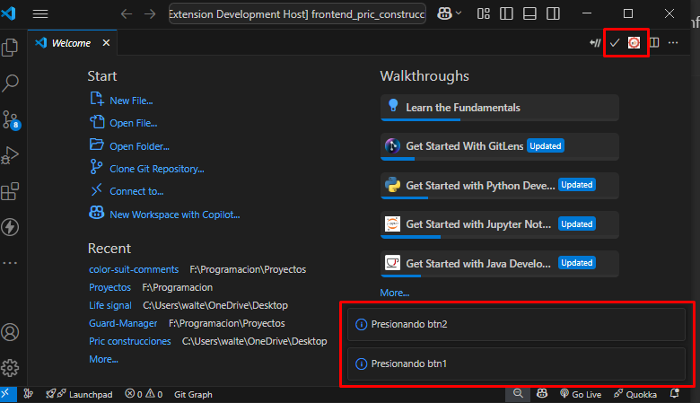


</div>
</details>

---
<!-- #endregion -->

<!-- #region ⁡⁢⁣⁣9. Codicon - íconos para extensiones en vsc⁡ -->
<details style="background-color:#ffffff10; padding:10px;">
<summary><span style="font-size:2.5rem;" id="9">9. Codicon - íconos para extensiones en vsc</span></summary>
<div>
Codicon es un repositorio de microsoft que ofrece una gran variedad de íconos los cuales pueden ser incluidos dentro de las extensiones.
Para usarlos, simplemente se los referencia mediante su nombre dentro del `package.json` tal y como se muestra en el siguiente segmento:

``` JSON
  "contributes": {
    "commands": [
      {
        "command": "colorSuitComments.btn",
        "title": "btn",
        "icon": "$(check)"
      }
    ],
    "menus":{
      "editor/title": [
        {
          "command": "colorSuitComments.btn",
          "group": "navigation"
        }
      ]
    }
  },
```

En este caso se esta utilizando el icono `check`, pero dentro del enlace hay muchos íconos más. Cada ícono viene con su nombre de referencia:

<a href="https://microsoft.github.io/vscode-codicons/dist/codicon.html">https://microsoft.github.io/vscode-codicons/dist/codicon.html</a>

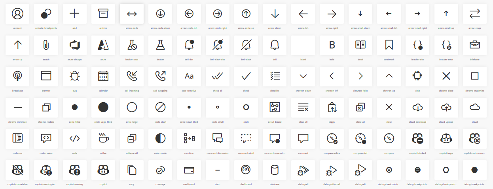

</div>
</details>

---
<!-- #endregion -->

<!-- #region ⁡⁢⁣⁣10. Métodos de almacenamiento de información⁡ -->
<div style="background-color:#ffffff10; padding:10px;">
<span style="font-size:2.5rem;" id="10">10. Métodos de almacenamiento de información</span>
<div>

<!-- #region ⁡⁢⁣⁣10a. Almacenamiento global⁡ -->

<details style="background-color:#ffffff10; padding:10px; margin:5px 0">
<summary><span style="font-size:1.5rem;" id="10a">10a. Almacenamiento global</span></summary>
<div>

Para almacenar información de forma global, VSC crea y edita un archivo llamado `settings.json`.
En el siguiente ejemplo se crea un botón en el panel `title/editor` y al darle click se abrirá un input box para que el usuario ingrese texto. El texto ingresado será guardado en el archivo `settings.json` y la información dentro del mismo persistirá entre proyectos.

<div style="background-color:#40e0e030; padding: 5px"><b>(ℹ) NOTA</b>: La información guardada globalmente persiste entre proyectos, significa que cualquier cambio realizado de esta forma afectará a todos los archivos que usen la extensión.</div>

Lo primero es configurar el `package.json`, dentro del campo `contributes` se debe agregar un nuevo campo llamado `configuration`, el cual nos permite gestionar el archivo de configuración `settings.json` y definir el contenido que neustra extensión escribirá dentro del mismo.

En la siguiente configuración, se crea un botón para acceder al comando y se establece dentro del campo `configuration` las propiedades pertinentes de la aplicación:

``` JSON
  "contributes": {
    "commands": [
      {
        "command": "colorSuitComments.btn",
        "title": "btn",
        "icon": "$(pass-filled)"
      }
    ],
    "menus":{
      "editor/title": [
        {
          "command": "colorSuitComments.btn",
          "group": "navigation"
        }
      ]
    },
    "configuration": {
      "title": "Color Suit Comments",
      "properties": {
        "colorSuitComments.keywords": {
          "type": "array",
          "items": {
            "type": "string"
          },
          "default": [],
          "description": "Palabras clave personalizadas para Color Suit Comments"
        }
      }
    }
  },
```

* ***"title"***: Define el nombre de la sección en la UI de configuración.
* ***"properties"***: Almacena las claves que puede configurar el usuario, en este caso `colorSuitComments.keywords`.
* ***"type":"Array"***: Acepta una lista de elementos.
* ***"items": { "type": "string" }"***: Indica que cada elemento en la lista debe ser un string.
* ***"default": []***: El valor inicial se establece como un arreglo vacio.
* ***"description"***: Define el texto que el usuario ve en la UI de configuración

Lo siguiente es agregarle funcionalidad al botón, asi que con el siguiente script vamos a guardar la información colocada por el usuario dentro del archivo `settings.json`:

``` TS
import * as vscode from 'vscode';

export function activate(context: vscode.ExtensionContext) {

    const disposableBtn = vscode.commands.registerCommand('colorSuitComments.btn', async () => {

      // Se pide un valor al usuario
      const input = await vscode.window.showInputBox({
        prompt: 'Ingresa una nueva palabra clave para Color Suit Comments'
      });

      if (!input) {
        vscode.window.showWarningMessage('No se ingresó ninguna palabra.');
        return;
      }

      // Captura la configuración de la extensión, en este caso 'colorSuitComments'
      const config = vscode.workspace.getWorkspaceConfiguration('colorSuitComments');

      // Captura las palabras claves almacenadas en el campo 'keywords', dentro de config
      const palabrasActuales = config.get<string[]>('keywords', []);

      // Crea una nueva lista agregando las palabras nuevas a la misma
      const nuevasPalabras = [...new Set([...palabrasActuales, input.trim()])]; // Evita duplicados

      // Actualiza la configuración global con la nueva lista
      await config.update('keywords', nuevasPalabras, vscode.ConfigurationTarget.Global);

      vscode.window.showInformationMessage(`Palabra clave "${input}" guardada correctamente.`);

    });

    context.subscriptions.push(disposableBtn);
}

export function deactivate() {}
```

Al ejecutar la extensión, si le damos click al botón con el icono del "check", vamos a ver algo como lo siguiente:

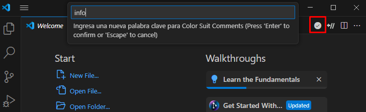

En este caso se agrego la palabra **"info"** dentro del input. Al darle enter se configrmará que se guardo correctamente:

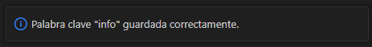

Para ver el archivo con los valores almacenados, debemos abrir la ventana de comandos presionando (ctrl+shift+p) y seleccionar la opcion **Preferences: Open User Settings (JSON)**:

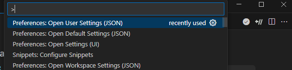

Al dar enter se abrirá el archivo `settings.json` y abajo de todo aparecerán todas las palabras que ingresemos en el input:

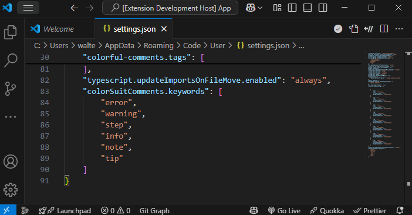
</div>
</details>

<!-- #endregion -->

</div>
</div>

---
<!-- #endregion -->

<!-- #region ⁡⁢⁣⁣11. Menú desplegable en el editor titulo/editor⁡ -->
<div style="background-color:#ffffff10; padding:10px;">
<span style="font-size:2.5rem;" id="11">11. Menú desplegable en el editor titulo/editor</span>
<div>

<!-- #region ⁡⁢⁣⁣11a. Despliegue desde el botón⁡ -->

<details style="background-color:#ffffff10; padding:10px; margin:5px 0">
<summary><span style="font-size:1.5rem;" id="11a">11a. Despliegue desde el botón</span></summary>
<div>

Lo primero es definir el cuerpo del `package.json` definiendo la estructura del submenu, para este caso será un botón el cual va a desplegar tres colores:

``` JSON
  "contributes": {
    "commands": [
      {
        "command": "colorSuitComments.colors",
        "title": "Colors"
      },
      {
        "command": "colorSuitComments.red",
        "title": "Rojo"
      },
      {
        "command": "colorSuitComments.green",
        "title": "Verde"
      },
      {
        "command": "colorSuitComments.blue",
        "title": "Azul"
      }
    ],
    "submenus": [
      {
        "id": "colorSuitComments.colors",
        "label": "Colores",
        "icon": "$(check)"
      }
    ],
    "menus": {
      "editor/title": [
        {
          "submenu": "colorSuitComments.colors",
          "group": "navigation",
        }
      ],
      "colorSuitComments.colors": [
        { 
          "command": "colorSuitComments.red",
           "label": "Red"
        },
        { 
          "command": "colorSuitComments.green",
           "label": "Green" 
        },
        { 
          "command": "colorSuitComments.blue",
           "label": "Blue" 
        }
      ]
    }
  },
```

1. Dentro del campo `commands` se declaran todos los comandos que podrá ejecutar la extensión. Incluye tanto los comandos que aparecerán como opciones del submenú (red, green, blue), como el que actuará como submenú principal (colors). El comando "colorSuitComments.colors" no se ejecuta directamente, simplemente se define para que el sistema lo reconozca y lo puedas referenciar como un submenu.
2. Luego, en el campo `submenus` se  define la entrada visual del submenú (el botón que se verá en la UI). Se le da un id, un label visible y un posible icon.
3. Dentro del campo `editor/title` de `menus`, e indica que en la barra superior del editor (zona "editor/title"), se agregue un submenu con el id del submenú definido en el paso anterior. Es decir, se le dice a VSC: “Agregá un botón con menú desplegable aquí”.
4. Finalmente, se crea un campo cuyo nombre debe coincidir con el id que se ejecuta al dar click en el submenu. Dentro se define qué elementos aparecen cuando se despliega el submenú. Cada ítem apunta a un comando declarado previamente. Estos sí son ejecutables, y son los que responden al clic del usuari

Ahora, se crea la lógica de ejecución para cada opción del submenu:

``` TS
import * as vscode from 'vscode';

export function activate(context: vscode.ExtensionContext) {
  
  const redCommand = vscode.commands.registerCommand('colorSuitComments.red', () => {
    vscode.window.showInformationMessage('Has seleccionado el color Rojo');
  });

  const greenCommand = vscode.commands.registerCommand('colorSuitComments.green', () => {
    vscode.window.showInformationMessage('Has seleccionado el color Verde');
  });

  const blueCommand = vscode.commands.registerCommand('colorSuitComments.blue', () => {
    vscode.window.showInformationMessage('Has seleccionado el color Azul');
  });

  context.subscriptions.push(redCommand, greenCommand, blueCommand);
}

export function deactivate() {}

```

Este código le agrega una simple funcionalidad para indicar con un mensaje cual opción se ha seleccionado y el resultado final es el siguiente:

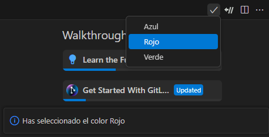

</div>
</details>

<!-- #endregion -->


</div>
</div>

---
<!-- #endregion -->

<!-- #region ⁡⁢⁣⁣12. Segmentos colapsables⁡ -->
<details style="background-color:#ffffff10; padding:10px;">
<summary><span style="font-size:2.5rem;" id="12">12. Segmentos colapsables</span></summary>
<div>


</div>
</details>

---
<!-- #endregion -->

