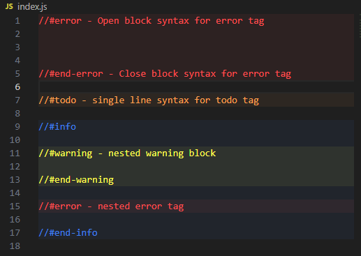
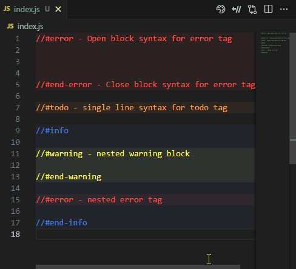
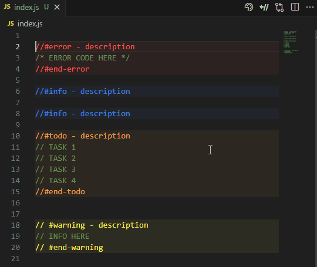
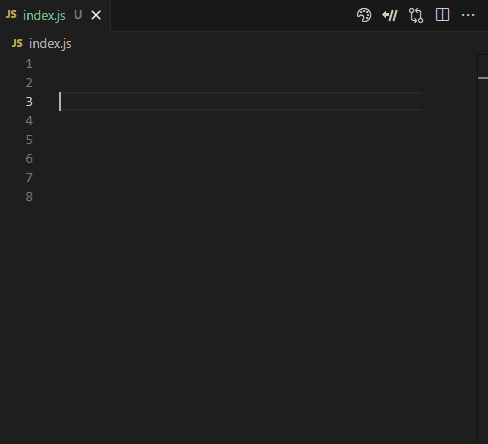

# Color-Suit-Comments

Color Suit Comments is a Visual Studio Code extension that allows you to add custom styles to code comments using configurable tags.

You can also create collapsible blocks by using matching opening and closing tags, making it easier to structure and navigate large files.

The extension works in real time, supports multi-file visualization, and can be fully customized via the `settings.json` file.

Currently compatible with JavaScript, TypeScript, HTML, CSS, Python, PHP, C, C++, and C#.

## Features

- Apply **custom styles** to code comments using configurable tags (text color and background)

- Define **collapsible blocks** using matching opening and closing tags.

  

- Easily access and edit the configuration via a dedicated **Edit tags** menu option.
- Ships with a default set of tags, but you can **add, remove, or edit** them via `settings.json`.

  

- Use the **Toggle Blocks** command to collapse or expand all tag-defined blocks with one click.

  

- Automatically updates **in real time** as you type.

  

- Works across **multiple open files** simultaneously.

## Requirements

There are no additional requirements or dependencies needed to use this extension. It works out of the box.

## Extension Settings

This extension contributes the following setting:

- `colorSuitComments.tags`:  
  An array of tag definitions used to apply custom styles to comments.  
  Each tag can include:
  - `tag` (required): The name of the tag to match in comments.
  - `color`: The text color to apply.
  - `backgroundColor`: The background color for the block (if it becomes collapsible).

You can edit these settings directly via the command **"Edit tags"**, which opens your `settings.json` file.

## Supported Languages

Color Suit Comments supports comment-based tagging and folding in the following languages:

- HTML (`.html`)
- CSS (`.css`)
- JavaScript (`.js`)
- TypeScript (`.ts`)
- Python (`.py`)
- PHP (`.php`)
- C (`.c`)
- C++ (`.cpp`)
- C# (`.cs`)

## Known Issues

Currently, the extension only works with JavaScript and TypeScript files.
- In some light themes, the default tag styles (especially with opacity) may not be fully readable. Users are encouraged to adjust the tag colors via `settings.json` to match their theme.
- When using multi-line comment blocks (`/* */`), applying a tag with a background color that includes opacity may result in slightly overlapping decorations on inner lines.
- Collapsible blocks require matching opening and closing tags with the same context. Incorrectly nested tags will not be considered collapsible, but will still apply styles individually.
- The snippet suggestions that appear after typing `#` may be slightly delayed the first time they are triggered.

## Release Notes

### 0.0.3

- Support for comment-based folding blocks in `.c`, `.cpp`, `.cs`, `php` and `python` files.

### 0.0.2

- Support for comment-based folding blocks in `.html` and `.css` files.

### 0.0.1

Initial release of **Color Suit Comments**.

- Apply custom styles to code comments using configurable tags (`color` and `backgroundColor`).
- Define collapsible comment blocks with matching opening and closing tags.
- Edit tag settings directly from the editor via the **Edit Tags** command.
- Toggle all collapsible blocks at once with the **Toggle Collapse All** command.
- Works in real time across multiple files.
- Includes default tags: `error`, `warning`, `todo`, and `info`.
- Supports JavaScript and TypeScript.
